# Facial Emotions Recognition

### Domain Background

Facial emotions are important factors in human communication that help us understand the intentions of others. In general, people infer the emotional states of other people, such as joy, sadness, and anger, using facial expressions and vocal tone. According to different surveys, verbal components convey one-third of human communication, and nonverbal components convey two-thirds. Among several nonverbal components, by carrying emotional meaning, facial expressions are one of the main information channels in interpersonal communication. Interest in automatic facial emotion recognition (FER) has also been increasing recently with the rapid development of artificial intelligent techniques, including in human-computer interaction (HCI), virtual reality (VR), augment reality (AR), advanced driver assistant systems (ADASs), and entertainment. Although various sensors such as an electromyograph (EMG), electrocardiogram (ECG), electroencephalograph (EEG), and camera can be used for FER inputs, a camera is the most promising type of sensor because it provides the most informative clues for FER and does not need to be worn.

My journey to decide on this project was exciting. My motive was to prove the utility of Deep neural nets in the contemporary research. Facial emotional recoginition/ pattern recognintion had been in research since long. The following acaemic papers were very helpful in  

1. [Giving a historic overview of research in Facial Emotional Recognition](https://www.ncbi.nlm.nih.gov/pmc/articles/PMC5856145/)
2. [Deciding on a posed dataset with seven different emotions](http://www.consortium.ri.cmu.edu/data/ck/CK+/CVPR2010_CK.pdf)
3. [Developing a baseline algorithm](https://pdfs.semanticscholar.org/9bf2/c915943cb74add761ec4636f323337022a97.pdf)
4. [Improving the Facial Emotions Recognition using Deep Convolutional Neuralnets](https://arxiv.org/pdf/1509.05371v2.pdf)

### Problem Statement


 The objective of this project is to showcase two different solutions in solving the problem of Facial emotional recognition from a posed dataset. Both the solutions are based on the problem space of supervised learning. But the first solution I propose is more involved and has more human interference than the second solution which uses state of art artificial neuralnets. The goal is to compare the two approaches using a performance metric - i.e how well the supervised learning model detects the expression posed in a still image. The posed dataset has labels associated with it. The labels define the most probable emotion. After running our two supervised learning model, we use accuracy score as the performance metric to decide how well the model has performed.
 
accuracy score = A ratio of # of correctly predicted emotions in images / total number of images.

### Datasets and Inputs

I use [Cohn-Kanade dataset](http://www.consortium.ri.cmu.edu/ckagree/). This dataset has been introduced by [Lucey et al](http://www.pitt.edu/~jeffcohn/CVPR2010_CK+2.pdf). 210 persons, aged 18 to 50, have been recorded depicting emotions.Out of 210 people, only 123 subjects gave posed facial expression. This dataset contains the recordings of their emotions. Both female and male persons are present from different background. 81 % Euro-Americans and 13%  are Afro-Americans. The images are of size 640 * 490 pixels as well as 640 * 480 pixels.  They are both grayscale and colored. in total there are 593 emotion-labeled sequences. There are seven different emotions that are depicted. They are:

0. 0=Neutral
1. 1=Anger
2. 2=Contempt
3. 3=Disgust
4. 4=Fear
5. 5=Happy
6. 6=Sadness
7. 7=Surprise

The images within each subfolder may have an image sequence of the subject. The first image in the sequence starts with a neutral face and the final image in the sub folder has the actual emotion. So from each subfolder ( image sequence), I have to extract two images,  the neutral face and final image with an emotion. ONLY 327 of the 593 sequences have emotion sequences. This is because these are the only ones the fit the prototypic definition. Also all these files are only one single emotion file. I have to preprocess this dataset to make it as an uniform input. I will make sure the images are all of same size and atmost it has one face depicting the emotion for now. After detecting the face in the image, I will convert the image to grayscale image, crop it and save it. I will use OpenCV to automate face finding process. OpenCv comes up with 4 different pre-trained  classifiers. I will use all of them to find the face in the image and abort the process when the face is identified. These identified, cropped, resize image becomes input feature. The emotion labels are the output.


### Solution Statement


#### Data Preprocessing

**Methodology**

1. Download the following zip files from [Cohn-kanande+ website](http://www.consortium.ri.cmu.edu/ckagree/)
    - extended-cohn-kanade-images.zip
    - Emotion_labels.zip
2. Download haarcascade files from the [github](https://github.com/karthikBalasubramanian/opencv.git)
3. Download shape predictor file from [here](http://dlib.net/files/shape_predictor_68_face_landmarks.dat.bz2)
4. rename the images folder as `source_images`
5. rename the lables folder as `source_emotion`
6. Create two folders `pre_dataset` and `dataset`. `pre_dataset` arranges images by emotions and `dataset` checks if images has a face and resizes the faces of all images to 350 * 350 grayscale images.
7. copy the peak frames of each image sequence to the specified emotions folder in pre_dataset.[Please read about image sequences in this paper](http://www.pitt.edu/~jeffcohn/CVPR2010_CK+2.pdf). 
8. Save all the first frame for all image sequences per person. Choose one first frame image per person at random. They will go into neutral folder of `pre_dataset`
9. After doing a face identification check with haarcascades filters, move the images to their respected emotions folder from `pre_dataset` to `dataset` parent folder.


```python
import warnings
warnings.filterwarnings('ignore')
import glob
from shutil import copyfile
import random
random.seed(123)
emotions = ["neutral", "anger", "contempt", "disgust", "fear", "happy", "sadness", "surprise"]
```


```python
observations = glob.glob("source_emotion/*")
```


```python
neutral_file_dict={}
for obs in observations:
    obs_id = str(obs[-4:])
    neutral_file_dict[obs_id]=list()
    emotions_folders = "{0}/*".format(str(obs))
    emotions_sessions =  glob.glob(emotions_folders)
    for each_emotion_session in emotions_sessions:
        emotion_sequence_folder = "{0}/*".format(each_emotion_session)
        emotion_sequence_files = glob.glob(emotion_sequence_folder)
        # if emotion is identifed
        # map the peak frame image to the specified emotion folder in the dataset
        # map the first frame image to the neutral folder in the dataset.
        for emotion_output in emotion_sequence_files:
            emotion_seq_no = emotion_output[20:23]
            # read the emotion in the file
            file = open(emotion_output, 'r')
            emotion= int(float(file.readline()))
            peak_frame_emotion = sorted(glob.glob("source_images/{0}/{1}/*".format(obs_id,emotion_seq_no)))[-1]
            first_frame_emotion = sorted(glob.glob("source_images/{0}/{1}/*".format(obs_id,emotion_seq_no)))[0]
            neutral_file_dict[obs_id].append(first_frame_emotion)
            peak_emotion_img_name = "pre_dataset/{0}/{1}".format(emotions[emotion], peak_frame_emotion[23:])
            # now copy peak frame to respective folders in dataset
            copyfile(peak_frame_emotion, peak_emotion_img_name)
```


```python
for key in neutral_file_dict.keys():
    if len(neutral_file_dict[key])>0:
        # randomly copy neutral frames to neutral folder
        source_file = random.choice(neutral_file_dict[key])
        neutral_emotion_img_name = "pre_dataset/neutral/{0}".format(source_file[23:])
        copyfile(source_file, neutral_emotion_img_name)
```


```python
# code taken from http://www.paulvangent.com/2016/04/01/emotion-recognition-with-python-opencv-and-a-face-dataset/
import cv2
faceDet = cv2.CascadeClassifier("haarcascades/haarcascade_frontalface_default.xml")
faceDet_two = cv2.CascadeClassifier("haarcascades/haarcascade_frontalface_alt2.xml")
faceDet_three = cv2.CascadeClassifier("haarcascades/haarcascade_frontalface_alt.xml")
faceDet_four = cv2.CascadeClassifier("haarcascades/haarcascade_frontalface_alt_tree.xml")
def detect_faces(emotion):
    files = glob.glob("pre_dataset/{0}/*".format(emotion)) #Get list of all images with emotion
    filenumber = 0
    for f in files:
        frame = cv2.imread(f) #Open image
        gray = cv2.cvtColor(frame, cv2.COLOR_BGR2GRAY) #Convert image to grayscale
        #Detect face using 4 different classifiers
        face = faceDet.detectMultiScale(gray, scaleFactor=1.1, minNeighbors=10, minSize=(5, 5), flags=cv2.CASCADE_SCALE_IMAGE)
        face_two = faceDet_two.detectMultiScale(gray, scaleFactor=1.1, minNeighbors=10, minSize=(5, 5), flags=cv2.CASCADE_SCALE_IMAGE)
        face_three = faceDet_three.detectMultiScale(gray, scaleFactor=1.1, minNeighbors=10, minSize=(5, 5), flags=cv2.CASCADE_SCALE_IMAGE)
        face_four = faceDet_four.detectMultiScale(gray, scaleFactor=1.1, minNeighbors=10, minSize=(5, 5), flags=cv2.CASCADE_SCALE_IMAGE)
        #Go over detected faces, stop at first detected face, return empty if no face.
        if len(face) == 1:
            facefeatures = face
        elif len(face_two) == 1:
            facefeatures = face_two
        elif len(face_three) == 1:
            facefeatures = face_three
        elif len(face_four) == 1:
            facefeatures = face_four
        else:
            facefeatures = ""
        #Cut and save face
        for (x, y, w, h) in facefeatures: #get coordinates and size of rectangle containing face
            gray = gray[y:y+h, x:x+w] #Cut the frame to size
            try:
                out = cv2.resize(gray, (350, 350)) #Resize face so all images have same size
                cv2.imwrite("dataset/{0}/{1}.png".format(emotion, filenumber), out) #Write image
            except:
               pass #If error, pass file
        filenumber += 1 
```


```python
for emotion in emotions:
    detect_faces(emotion)
```


```python
# Visualize the distribution of the dataset
import matplotlib.pyplot as plt                        
%matplotlib inline

image_dict = dict()
for emotion in emotions:
    image_dict[emotion] = len(glob.glob("dataset/{0}/*".format(emotion)))

plt.bar(range(len(image_dict)), list(image_dict.values()), align='center')
plt.xticks(range(len(image_dict)), list(image_dict.keys()), rotation=90)
plt.show()
```


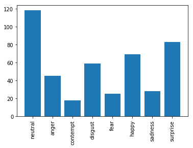


We can observe that there is an unequal distribution of dataset among emotions. But does it matter for our algorithms? Lets find out.

#### Feature Extraction - Baseline

[Images Courtesy - Cohn-Kanade+ paper](http://www.pitt.edu/~jeffcohn/CVPR2010_CK+2.pdf)


The following method has 2 different phases.

1. Finding the face - Libraries like dlib has handy functions like `get_frontal_face_detector` which is handy to identify the face region
2. Extracting the features in the face - This is where most of the research in the past has gone into. It has been done so far by realizing through manual interference. One of the method is called Facial Action Coding System (FACS) which describes Facial expression using Action Units (AU). An Action Unit is a facial action like "raising the Inner eyebrow". Multiple Activation units when combined expresses the emotion in the underlying face. An example is provided below.


I use dlib's `shape_predictor` and its learned landmark predictor `shape_predictor_68_face_landmarks.bat` to extract AUs. Then as suggested in the model pipeline I implement SVM to compare distances between the extracted facial landmarks for different emotions.

##### Visualizing Action Units


```python
#Import required modules
import cv2
import dlib
#Set up some required objects
detector = dlib.get_frontal_face_detector() #Face detector
predictor = dlib.shape_predictor("shape_predictor_68_face_landmarks.dat") #Landmark identifier. Set the filename to whatever you named the downloaded file
frame = cv2.imread("dataset/happy/1.png")
detections = detector(frame, 1) #Detect the faces in the image
for k,d in enumerate(detections):#For each detected face
    shape = predictor(frame, d) #Get coordinates
    for i in range(1,68):#There are 68 landmark points on each face
        cv2.circle(frame, (shape.part(i).x, shape.part(i).y), 1, (0,0,255), thickness=3) #For each point, draw a red circle with thickness2 on the original frame
plt.imshow(frame)#Display the frame
plt.title("happy")
plt.show()
```


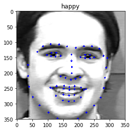


##### Example of shape predictor coordinates without the image


```python
import numpy as np
sample_x = list()
sample_y = list()
detections = detector(frame, 1) #Detect the faces in the image
for k,d in enumerate(detections):#For each detected face
    shape = predictor(frame, d) #Get coordinates
    for i in range(1,68):
        sample_x.append(float(shape.part(i).x))
        sample_y.append(float(shape.part(i).y))
        
plt.plot(sample_x, sample_y)
plt.xlim((0,350))
plt.ylim((0,350))
plt.gca().invert_yaxis()
plt.show()
```


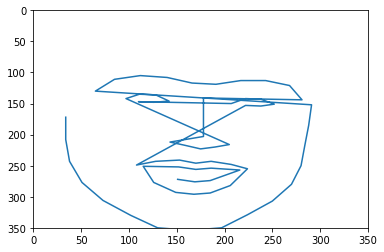


```python
print(len(sample_x), len(sample_y))
```

    67 67


The `shape_predictor_68_face_landmarks` above ave extracted 67 points in any face in both X and Y axis from the image presented. This X and Y points when combined becomes a Facial Landmark. They describe the position of all the “moving parts” of the depicted face, the things you use to express an emotion. The good thing about extracting facial landmark is that I will be extracting very important information from the image to use it and classify an emotion. But,

There are some problems when we directly capture these facial landmarks.

- They may change as face moves to different parts of the frame. An image could be expressing the same emotion in the top left pixel as in the bottom right pixel of another image, but the resulting coordinate matrix would express different numerical ranges and hence the two images can be classfied to different emotion instead of the same emotion.Therefore we need a location invariant coordinate matrix to help us classify an emotion.

The solution to this problem is derived in the following way.

1. Find the center of the shap predictor vector
2. Calculate the distance between all the shape predictor points to their center
3. Calculate the angle at which these points find themselves relative to the center point. 


What we now have is the relationship between all the points with the center point and how they are relatively positioned in the 2D space.Each tuple will have the following values `<x, y, distance_from_center, angle_relative_to_center>`. This additional information to each coordinate makes it location invariant. i.e There is a way to derive these points in the 2D system.


```python
import math
def get_landmarks(image):
    data={}
    detections = detector(image, 1)
    for k,d in enumerate(detections): #For all detected face instances individually
        shape = predictor(image, d) #Draw Facial Landmarks with the predictor class
        xlist = []
        ylist = []
        for i in range(1,68): #Store X and Y coordinates in two lists
            xlist.append(float(shape.part(i).x))
            ylist.append(float(shape.part(i).y))
        # calculate the center of gravity
        xmean = np.mean(xlist)
        ymean = np.mean(ylist)
        # calculate the distance from center from both axis.
        # this information is used to get the angle relative to center point.
        xcentral = [(x-xmean) for x in xlist]
        ycentral = [(y-ymean) for y in ylist]
        landmarks_vectorised = []
        for x, y, w, z in zip(xcentral, ycentral, xlist, ylist):
            # append x and y values
            landmarks_vectorised.append(w)
            landmarks_vectorised.append(z)
            meannp = np.asarray((ymean,xmean))
            coornp = np.asarray((z,w))
            # calculate the euclidiean distance from center
            dist = np.linalg.norm(coornp-meannp)
            # append the distance to the feature vector
            landmarks_vectorised.append(dist)
            # apend the angle relative to the center of gravity.
            landmarks_vectorised.append(math.degrees(math.atan2(y,x)))
        data['landmarks_vectorised'] = landmarks_vectorised
    if len(detections) < 1:
        data['landmarks_vestorised'] = "error"
    return data
```


```python
print(get_landmarks(frame)["landmarks_vectorised"][0:4])
```

    [34.0, 172.0, 143.73715832690573, -163.42042572345252]


#### Train-test split - baseline

Two helper functions below does the following work
1. `get_files` to randomly split the data in each emotion folder to training and test files. I have used 80/20 split.
2. `make_sets` runs across each emotion folder and gets the training and test files from `get_files` function. It then converts each image to feature using `get_landmarks` function and tags the file to the emotion label. Thus we have our training_data, training_labels, test_data, test_labels


```python
def get_files(emotion):
    files = glob.glob("dataset/{0}/*".format(emotion))
    random.shuffle(files)
    train = files[:int(len(files)*0.8)] #get first 80% of file list
    test = files[-int(len(files)*0.2):] #get last 20% of file list
    return train, test
```


```python
def make_sets():
    training_data = []
    training_labels = []
    test_data = []
    test_labels = []
    train_files_list = [] # its a list of dict of trainfiles
    test_files_list = [] 
    for emotion in emotions:
        #print(" working on %s" %emotion)
        train, test = get_files(emotion)
        #Append data to training and prediction list, and generate labels 0-7
        for item in train:
            d = dict()
            d["name"]= item
            d["emotion"] = emotions.index(emotion)
            train_files_list.append(d)
            image = cv2.imread(item) #open image
            data = get_landmarks(image)
            if data['landmarks_vectorised'] == "error":
                print("no face detected on this one")
            else:
                training_data.append(data['landmarks_vectorised']) #append image array to training data list
                training_labels.append(emotions.index(emotion))
        for item in test:
            d = dict()
            d["name"]= item
            d["emotion"] = emotions.index(emotion)
            test_files_list.append(d)
            image = cv2.imread(item)
            data = get_landmarks(image)
            if data['landmarks_vectorised'] == "error":
                print("no face detected on this one")
            else:
                test_data.append(data['landmarks_vectorised'])
                test_labels.append(emotions.index(emotion))
    return training_data, training_labels, test_data, test_labels, train_files_list, test_files_list
```

#### Model Application - Baseline

  I have chosen Support vector machines (SVMs) to map the different facial features to their emotions. SVMs attempt to find the hyperplane that maximizes the margin between positive and negative observations for a specified emotion class. Therefore its also called Maximum margin classifier.
  
  We use libSVM which uses one vs one classifier. i.e It will create $ (K * (K-1))/2 $ binary classifiers in total - where K here is number of classes 8. A total of 28 binary classfiers are created. 
  

##### Applying Linear SVM
> Definitions taken from [Cohn-Kanade+ paper](http://www.pitt.edu/~jeffcohn/CVPR2010_CK+2.pdf)

A linear SVM classification decision is made for an unlabeled test observation `x*` by,

$w^Tx^* >^{true}  b$  
$w^Tx^* <=^{false} b$  

where w is the vector normal to the separating hyperplane and b is the bias. Both w and b are estimated so that they minimize the risk of a train-set, thus avoiding the possibility of overfitting to the training data. Typically, w is not defined explicitly, but through a linear sum of support vectors.

Lets understand the accuracy of the model in identifying the emotion based on the features we developed. We have asked the model to provide probability scores of the model on different categories.


```python
from sklearn.svm import SVC
clf_lin_svm = SVC(kernel='linear', random_state=7, probability=True, tol=1e-3)
test_trails = []
train_trails = []
for i in range(0,10):
    print("Making sets for trail #%s" %i) #Make sets by random sampling 80/20%
    train_data, train_labels, test_data, test_labels, train_files_list, test_files_list = make_sets()
    X_train = np.array(train_data) #Turn the training set into a numpy array for the classifier
    y_train = np.array(train_labels)
    print("training SVM linear for trail #%s" %i) #train SVM
    clf_lin_svm.fit(X_train, y_train)
    print("getting accuracies for trail #%s" %i) #Use score() function to get accuracy
    X_test = np.array(test_data)
    y_test = np.array(test_labels)
    train_accuracy = clf_lin_svm.score(X_train, y_train)
    test_accuracy = clf_lin_svm.score(X_test, y_test)
    print("Train Accuracy Score for trail #{0} = {1} ".format(i, train_accuracy))
    print("Test Accuracy Score for trail #{0} = {1} ".format(i,test_accuracy))
    test_trails.append(test_accuracy) #Store accuracy in a list
    train_trails.append(train_accuracy)
    print("")
print("Mean Train accuracy score: %s" %np.mean(train_trails))
print("Mean Test accuracy score: %s" %np.mean(test_trails)) #Get mean accuracy of the 10 runs
```

    Making sets for trail #0
    training SVM linear for trail #0
    getting accuracies for trail #0
    Train Accuracy Score for trail #0 = 1.0 
    Test Accuracy Score for trail #0 = 0.7764705882352941 
    
    Making sets for trail #1
    training SVM linear for trail #1
    getting accuracies for trail #1
    Train Accuracy Score for trail #1 = 1.0 
    Test Accuracy Score for trail #1 = 0.8470588235294118 
    
    Making sets for trail #2
    training SVM linear for trail #2
    getting accuracies for trail #2
    Train Accuracy Score for trail #2 = 1.0 
    Test Accuracy Score for trail #2 = 0.8235294117647058 
    
    Making sets for trail #3
    training SVM linear for trail #3
    getting accuracies for trail #3
    Train Accuracy Score for trail #3 = 1.0 
    Test Accuracy Score for trail #3 = 0.8470588235294118 
    
    Making sets for trail #4
    training SVM linear for trail #4
    getting accuracies for trail #4
    Train Accuracy Score for trail #4 = 1.0 
    Test Accuracy Score for trail #4 = 0.8705882352941177 
    
    Making sets for trail #5
    training SVM linear for trail #5
    getting accuracies for trail #5
    Train Accuracy Score for trail #5 = 1.0 
    Test Accuracy Score for trail #5 = 0.8235294117647058 
    
    Making sets for trail #6
    training SVM linear for trail #6
    getting accuracies for trail #6
    Train Accuracy Score for trail #6 = 1.0 
    Test Accuracy Score for trail #6 = 0.8705882352941177 
    
    Making sets for trail #7
    training SVM linear for trail #7
    getting accuracies for trail #7
    Train Accuracy Score for trail #7 = 1.0 
    Test Accuracy Score for trail #7 = 0.8470588235294118 
    
    Making sets for trail #8
    training SVM linear for trail #8
    getting accuracies for trail #8
    Train Accuracy Score for trail #8 = 1.0 
    Test Accuracy Score for trail #8 = 0.8588235294117647 
    
    Making sets for trail #9
    training SVM linear for trail #9
    getting accuracies for trail #9
    Train Accuracy Score for trail #9 = 1.0 
    Test Accuracy Score for trail #9 = 0.8235294117647058 
    
    Mean Train accuracy score: 1.0
    Mean Test accuracy score: 0.8388235294117647


###### Calculating the Log loss of this model


```python
from sklearn.metrics import log_loss
train_pred_proba_lin = clf_lin_svm.predict_proba(X_train)
print(log_loss(train_labels, train_pred_proba_lin))
test_pred_proba_lin =clf_lin_svm.predict_proba(X_test)
print(log_loss(test_labels, test_pred_proba_lin))
```

    0.33409156863493306
    0.5263032082292124


Amazing, We got a mean accuracy of `84%` in our 10 trails. Lets examine if the rest of the `16%` can be classified if the features are transformed to a higher dimension.

#### Comparing with SVM Linear and SVM Polynomial Kernal

   The kernel methods in SVM are used when we don't have lineraly seperable data. Kernel methods transform the data to higher dimension to make them seperable. Let's identify if that is the case with our dataset.By default, we have our feature set expressed to a 3 degree polynomial.


```python
# TODO: Initialize the three models

clf_poly_svm = SVC(kernel="poly", random_state=11, probability=True, tol=1e-3)

test_trails = []
train_trails = []
for i in range(0,10):
    print("Making sets for trail #%s" %i) #Make sets by random sampling 80/20%
    train_data, train_labels, test_data, test_labels, train_files_list, test_files_list = make_sets()
    X_train = np.array(train_data) #Turn the training set into a numpy array for the classifier
    y_train = np.array(train_labels)
    print("training SVM Poly for trail #%s" %i) #train SVM
    clf_poly_svm.fit(X_train, y_train)
    print("getting accuracies for trail #%s" %i) #Use score() function to get accuracy
    X_test = np.array(test_data)
    y_test = np.array(test_labels)
    train_accuracy = clf_poly_svm.score(X_train, y_train)
    test_accuracy = clf_poly_svm.score(X_test, y_test)
    print("Train Accuracy Score for trail #{0} = {1} ".format(i, train_accuracy))
    print("Test Accuracy Score for trail #{0} = {1} ".format(i,test_accuracy))
    test_trails.append(test_accuracy) #Store accuracy in a list
    train_trails.append(train_accuracy)
    print("")
print("Mean Train accuracy score: %s" %np.mean(train_trails))
print("Mean Test accuracy score: %s" %np.mean(test_trails)) #Get mean accuracy of the 10 runs
```

    Making sets for trail #0
    training SVM Poly for trail #0
    getting accuracies for trail #0
    Train Accuracy Score for trail #0 = 1.0 
    Test Accuracy Score for trail #0 = 0.8235294117647058 
    
    Making sets for trail #1
    training SVM Poly for trail #1
    getting accuracies for trail #1
    Train Accuracy Score for trail #1 = 1.0 
    Test Accuracy Score for trail #1 = 0.7294117647058823 
    
    Making sets for trail #2
    training SVM Poly for trail #2
    getting accuracies for trail #2
    Train Accuracy Score for trail #2 = 1.0 
    Test Accuracy Score for trail #2 = 0.7764705882352941 
    
    Making sets for trail #3
    training SVM Poly for trail #3
    getting accuracies for trail #3
    Train Accuracy Score for trail #3 = 1.0 
    Test Accuracy Score for trail #3 = 0.8117647058823529 
    
    Making sets for trail #4
    training SVM Poly for trail #4
    getting accuracies for trail #4
    Train Accuracy Score for trail #4 = 1.0 
    Test Accuracy Score for trail #4 = 0.8588235294117647 
    
    Making sets for trail #5
    training SVM Poly for trail #5
    getting accuracies for trail #5
    Train Accuracy Score for trail #5 = 1.0 
    Test Accuracy Score for trail #5 = 0.8117647058823529 
    
    Making sets for trail #6
    training SVM Poly for trail #6
    getting accuracies for trail #6
    Train Accuracy Score for trail #6 = 1.0 
    Test Accuracy Score for trail #6 = 0.7764705882352941 
    
    Making sets for trail #7
    training SVM Poly for trail #7
    getting accuracies for trail #7
    Train Accuracy Score for trail #7 = 1.0 
    Test Accuracy Score for trail #7 = 0.7647058823529411 
    
    Making sets for trail #8
    training SVM Poly for trail #8
    getting accuracies for trail #8
    Train Accuracy Score for trail #8 = 1.0 
    Test Accuracy Score for trail #8 = 0.8705882352941177 
    
    Making sets for trail #9
    training SVM Poly for trail #9
    getting accuracies for trail #9
    Train Accuracy Score for trail #9 = 1.0 
    Test Accuracy Score for trail #9 = 0.7529411764705882 
    
    Mean Train accuracy score: 1.0
    Mean Test accuracy score: 0.7976470588235294


###### Calculating the Log loss of this model


```python
train_pred_proba_poly = clf_poly_svm.predict_proba(X_train)
print(log_loss(train_labels, train_pred_proba_poly))
test_pred_proba_poly =clf_poly_svm.predict_proba(X_test)
print(log_loss(test_labels, test_pred_proba_poly))
```

    0.30353529485862646
    0.670569703987616


Surprisingly there doesn't seem to be a great difference in the performance of the Polynomial SVM when compared to linear SVM. May be our extracted and enriched feature set caused additional variance and overfitted the training data. We will for now go with the Linear SVM as our baseline and check the confusion matrix.


```python
# taken from https://scikit-learn.org/stable/auto_examples/model_selection/plot_confusion_matrix.html
from sklearn.metrics import confusion_matrix
def plot_confusion_matrix(y_true, y_pred, classes,
                          normalize=False,
                          title=None,
                          cmap=plt.cm.Blues):
    """
    This function prints and plots the confusion matrix.
    Normalization can be applied by setting `normalize=True`.
    """
    if not title:
        if normalize:
            title = 'Normalized confusion matrix'
        else:
            title = 'Confusion matrix, without normalization'

    # Compute confusion matrix
    cm = confusion_matrix(y_true, y_pred)
    # Only use the labels that appear in the data
    if normalize:
        cm = cm.astype('float') / cm.sum(axis=1)[:, np.newaxis]
        print("Normalized confusion matrix")
    else:
        print('Confusion matrix, without normalization')

    #print(cm)
    fig, ax = plt.subplots(figsize=(8,8))
    im = ax.imshow(cm, interpolation='nearest', cmap=cmap)
    ax.figure.colorbar(im, ax=ax)
    # We want to show all ticks...
    ax.set(xticks=np.arange(cm.shape[1]),
           yticks=np.arange(cm.shape[0]),
           # ... and label them with the respective list entries
           xticklabels=classes, yticklabels=classes,
           title=title,
           ylabel='True label',
           xlabel='Predicted label')

    # Rotate the tick labels and set their alignment.
    plt.setp(ax.get_xticklabels(), rotation=90, ha="right",
             rotation_mode="anchor")

    # Loop over data dimensions and create text annotations.
    fmt = '.2f' if normalize else 'd'
    thresh = cm.max() / 2.
    for i in range(cm.shape[0]):
        for j in range(cm.shape[1]):
            ax.text(j, i, format(cm[i, j], fmt),
                    ha="center", va="center",
                    color="white" if cm[i, j] > thresh else "black")
    fig.tight_layout()
    return ax
```


```python
test_pred = clf_lin_svm.predict(test_data)
```


```python
np.set_printoptions(precision=2)

# Plot normalized confusion matrix
plot_confusion_matrix(test_labels, test_pred, classes=emotions, normalize=True,
                      title='Normalized confusion matrix')

plt.show()
```

    Normalized confusion matrix


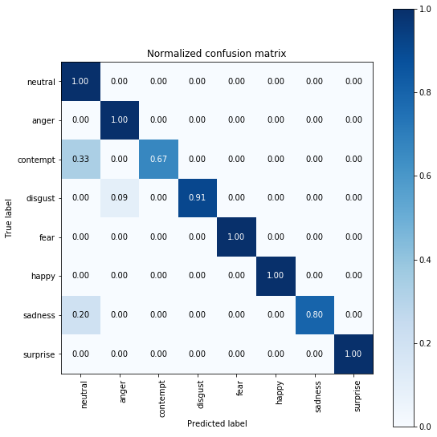


```python
import pandas as pd
train_df = pd.DataFrame(train_files_list)
test_df = pd.DataFrame(test_files_list)
```


```python
np.unique(test_df["emotion"])
```


    array([0, 1, 2, 3, 4, 5, 6, 7])


```python
test_df.groupby("emotion").size()
```


    emotion
    0    23
    1     9
    2     3
    3    11
    4     5
    5    13
    6     5
    7    16
    dtype: int64


```python
# visualize the distribution of emotions in test set
test_df.hist(column="emotion", bins = len(np.unique(test_df["emotion"])))
```


    array([[<matplotlib.axes._subplots.AxesSubplot object at 0x7f98c6e4ffd0>]],
          dtype=object)


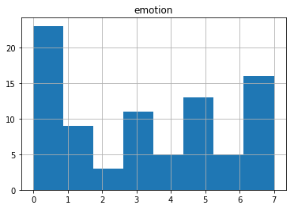


We have very limited test samples in Contempt, Fear and Sadness emotion. Lets visualize the emotions that went wrong.


```python
test_df["prediction"] = test_pred
# distil all the misclassified images.
miscalssified_df = test_df[test_df["emotion"]!=test_df["prediction"]]
display(miscalssified_df)
```


<div>
<style scoped>
    .dataframe tbody tr th:only-of-type {
        vertical-align: middle;
    }

    .dataframe tbody tr th {
        vertical-align: top;
    }

    .dataframe thead th {
        text-align: right;
    }
</style>
<table border="1" class="dataframe">
  <thead>
    <tr style="text-align: right;">
      <th></th>
      <th>emotion</th>
      <th>name</th>
      <th>prediction</th>
    </tr>
  </thead>
  <tbody>
    <tr>
      <th>32</th>
      <td>2</td>
      <td>dataset/contempt/14.png</td>
      <td>0</td>
    </tr>
    <tr>
      <th>45</th>
      <td>3</td>
      <td>dataset/disgust/31.png</td>
      <td>1</td>
    </tr>
    <tr>
      <th>64</th>
      <td>6</td>
      <td>dataset/sadness/17.png</td>
      <td>0</td>
    </tr>
  </tbody>
</table>
</div>


```python
# Showing the misclassified image and its predicted probability

image = cv2.imread("dataset/disgust/31.png")
plt.title("predicted = {0}/ Actual = {1}".format(emotions[clf_lin_svm.predict(test_data)[45]], emotions[test_labels[45]]))
plt.imshow(image)
plt.show()
clf_lin_svm.predict_proba(test_data)[45]
```


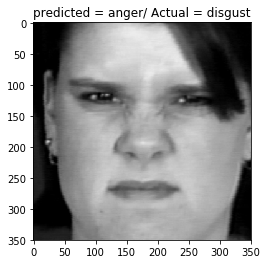


    array([0.04, 0.77, 0.01, 0.16, 0.01, 0.  , 0.01, 0.  ])


I am confident about my methodology. But I am not very confident if I have collected enough data. I am going to go with the same dataset and explore how my model performs with some wild images later after I define my deep neural nets.

## Deep Neural Nets
In the next section I will compare the hand crafted baseline model with a neural net. My goal here is to do very minimal work, reuse the wealthy knowledge of deep networks that have been proven before for image detection. The concepts are the same, but the task to identify is only different. 

Here are the steps I am planning to take to make my model more generic and expressive to capture the emotions.

  - Feature Extraction - Convert all the images to 4 dimensional tensors.
  - Get Bottlenect features using default VGG16 weights.
  - Create a new model to train the bottleneck features to capture the emotions
  - predict the emotions from Bottleneck test features.
  - Analyze the confusion matrix
  - Compare performances with Baseline model results.
  
#### Transfer Learning - Feature Extraction
In this setion, I will:

1. Split the train set into 80/20 train, validation set.
2. get the image files and data
3. convert the files into pixel features and create bottleneck VGG16 Tensors
4. convert the emotion label into one-hot encoded features


```python
import keras
from keras import backend as K
from keras.preprocessing import image
from tqdm import tqdm
```

    Using TensorFlow backend.


```python
from sklearn.utils import shuffle
shuffled_df = shuffle(train_df).reset_index(drop=True)
shuffled_df.head()
```


<div>
<style scoped>
    .dataframe tbody tr th:only-of-type {
        vertical-align: middle;
    }

    .dataframe tbody tr th {
        vertical-align: top;
    }

    .dataframe thead th {
        text-align: right;
    }
</style>
<table border="1" class="dataframe">
  <thead>
    <tr style="text-align: right;">
      <th></th>
      <th>emotion</th>
      <th>name</th>
    </tr>
  </thead>
  <tbody>
    <tr>
      <th>0</th>
      <td>7</td>
      <td>dataset/surprise/75.png</td>
    </tr>
    <tr>
      <th>1</th>
      <td>5</td>
      <td>dataset/happy/11.png</td>
    </tr>
    <tr>
      <th>2</th>
      <td>0</td>
      <td>dataset/neutral/6.png</td>
    </tr>
    <tr>
      <th>3</th>
      <td>7</td>
      <td>dataset/surprise/13.png</td>
    </tr>
    <tr>
      <th>4</th>
      <td>1</td>
      <td>dataset/anger/33.png</td>
    </tr>
  </tbody>
</table>
</div>


```python
# 80 % trainset, 20% valid set and the test_df will be the test set.
train_set_df = shuffled_df.iloc[:int(.8*len(shuffled_df))]
valid_set_df = shuffled_df.iloc[int(.8*len(shuffled_df)):]
```


```python
def load_dataset(data):
    image_files = np.array(data['name'])
    emotion_class = np.array(data['emotion'])
    return image_files, emotion_class
```


```python
# load train, test, and validation datasets
train_files, train_targets = load_dataset(train_set_df)
valid_files, valid_targets = load_dataset(valid_set_df)
test_files, test_targets = load_dataset(test_df)


# print statistics about the dataset
print('There are %s total emotion  files.\n' % len(np.hstack([train_files, valid_files, test_files])))
print('There are %d training emotion images.' % len(train_files))
print('There are %d validation emotion images.' % len(valid_files))
print('There are %d test emotion images.'% len(test_files))
```

    There are 439 total emotion  files.
    
    There are 283 training emotion images.
    There are 71 validation emotion images.
    There are 85 test emotion images.


```python
from keras.applications.vgg16 import VGG16
from keras.preprocessing import image
from keras.applications.vgg16 import preprocess_input as vgg_preprocess
from keras.layers import Input, GlobalAveragePooling2D, Dense, Dropout
from keras.models import Model, Sequential
from keras.callbacks import ModelCheckpoint
```


```python
##### Convert images to tensors and create bottleneck features

def path_to_tensor(img_path, model=None, model_preprocess=None, transfer_learn=True):
    # loads RGB image as PIL.Image.Image type
    img = image.load_img(img_path, target_size=(350, 350))
    # convert PIL.Image.Image type to 3D tensor with shape (350, 350)
    x = image.img_to_array(img)
    # convert 3D tensor to 4D tensor with shape (1, 224, 224, 3) and return 4D tensor
    x = np.expand_dims(x, axis=0)
    # get the bottleneck feature from the model
    if transfer_learn and (model is not None) and (model_preprocess is not None):
        return model.predict(model_preprocess(x))
    else:
        return x    

def paths_to_tensor(img_paths, model, model_preprocess):
    list_of_tensors = [path_to_tensor(img_path, model, model_preprocess) for img_path in tqdm(img_paths)]
    return np.vstack(list_of_tensors)
```


```python
model_VGG = VGG16(weights='imagenet', include_top=False)
```

    WARNING:tensorflow:From /home/karthikb/anaconda3/envs/fer/lib/python3.6/site-packages/tensorflow/python/framework/op_def_library.py:263: colocate_with (from tensorflow.python.framework.ops) is deprecated and will be removed in a future version.
    Instructions for updating:
    Colocations handled automatically by placer.


```python
from PIL import ImageFile                            
ImageFile.LOAD_TRUNCATED_IMAGES = True

train_tensors_VGG_bottleneck = paths_to_tensor(train_files, model_VGG, vgg_preprocess)
valid_tensors_VGG_bottleneck = paths_to_tensor(valid_files, model_VGG, vgg_preprocess)
test_tensors_VGG_bottleneck = paths_to_tensor(test_files, model_VGG, vgg_preprocess)
```

    100%|██████████| 283/283 [03:18<00:00,  1.52it/s]
    100%|██████████| 71/71 [00:46<00:00,  1.50it/s]
    100%|██████████| 85/85 [00:54<00:00,  1.48it/s]


##### Save Bottleneck tensors to a file


```python
np.savez("bottleneck_features.npz", train=train_tensors_VGG_bottleneck, valid=valid_tensors_VGG_bottleneck, test=test_tensors_VGG_bottleneck)
```


```python
npzfile = np.load("bottleneck_features.npz")
npzfile.files
```


    ['train', 'valid', 'test']


```python
print('Training: ',train_tensors_VGG_bottleneck.shape)
print('Validation: ',valid_tensors_VGG_bottleneck.shape)
print('Test: ',test_tensors_VGG_bottleneck.shape)
```

    Training:  (283, 10, 10, 512)
    Validation:  (71, 10, 10, 512)
    Test:  (85, 10, 10, 512)


```python
from keras.utils import np_utils
num_classes = len(emotions)
y_train = train_set_df.emotion
y_train = np_utils.to_categorical(y_train, num_classes)

y_valid = valid_set_df.emotion
y_valid = np_utils.to_categorical(y_valid, num_classes)

y_test = test_df.emotion
y_test = np_utils.to_categorical(y_test, num_classes)

print('Training: ',y_train.shape)
print('Validation: ',y_valid.shape)
print('Test: ',y_test.shape)
```

    Training:  (283, 8)
    Validation:  (71, 8)
    Test:  (85, 8)


```python
train_VGG16 = npzfile["train"]
valid_VGG16 = npzfile["valid"]
test_VGG16 = npzfile["test"]
```

##### Build the transfer learned VGG16


```python
VGG16_model = Sequential()
VGG16_model.add(GlobalAveragePooling2D(input_shape=train_VGG16.shape[1:]))
VGG16_model.add(Dense(len(emotions), activation='softmax'))

VGG16_model.summary()
```

    _________________________________________________________________
    Layer (type)                 Output Shape              Param #   
    =================================================================
    global_average_pooling2d_1 ( (None, 512)               0         
    _________________________________________________________________
    dense_1 (Dense)              (None, 8)                 4104      
    =================================================================
    Total params: 4,104
    Trainable params: 4,104
    Non-trainable params: 0
    _________________________________________________________________


##### Compile the Model


```python
VGG16_model.compile(loss='categorical_crossentropy', optimizer='adam', metrics=['accuracy'])
```

##### Train the Model


```python
checkpointer = ModelCheckpoint(filepath='saved_models/weights.best.VGG16.hdf5',
                               verbose=1, save_best_only=True)

VGG16_history = VGG16_model.fit(train_VGG16, y_train,
          validation_data=(valid_VGG16, y_valid),
          epochs=20, batch_size=20, callbacks=[checkpointer], verbose=1)
```

    WARNING:tensorflow:From /home/karthikb/anaconda3/envs/fer/lib/python3.6/site-packages/tensorflow/python/ops/math_ops.py:3066: to_int32 (from tensorflow.python.ops.math_ops) is deprecated and will be removed in a future version.
    Instructions for updating:
    Use tf.cast instead.
    Train on 283 samples, validate on 71 samples
    Epoch 1/20
    283/283 [==============================] - 1s 2ms/step - loss: 3.3142 - acc: 0.1767 - val_loss: 2.5928 - val_acc: 0.2394
    
    Epoch 00001: val_loss improved from inf to 2.59277, saving model to saved_models/weights.best.VGG16.hdf5
    Epoch 2/20
    283/283 [==============================] - 0s 491us/step - loss: 2.3239 - acc: 0.2933 - val_loss: 2.3492 - val_acc: 0.1690
    
    Epoch 00002: val_loss improved from 2.59277 to 2.34923, saving model to saved_models/weights.best.VGG16.hdf5
    Epoch 3/20
    283/283 [==============================] - 0s 509us/step - loss: 1.8706 - acc: 0.3746 - val_loss: 2.0867 - val_acc: 0.2535
    
    Epoch 00003: val_loss improved from 2.34923 to 2.08673, saving model to saved_models/weights.best.VGG16.hdf5
    Epoch 4/20
    283/283 [==============================] - 0s 484us/step - loss: 1.5735 - acc: 0.4664 - val_loss: 1.7980 - val_acc: 0.3380
    
    Epoch 00004: val_loss improved from 2.08673 to 1.79803, saving model to saved_models/weights.best.VGG16.hdf5
    Epoch 5/20
    283/283 [==============================] - 0s 592us/step - loss: 1.3770 - acc: 0.5442 - val_loss: 1.7254 - val_acc: 0.4225
    
    Epoch 00005: val_loss improved from 1.79803 to 1.72536, saving model to saved_models/weights.best.VGG16.hdf5
    Epoch 6/20
    283/283 [==============================] - 0s 572us/step - loss: 1.2175 - acc: 0.5936 - val_loss: 1.5979 - val_acc: 0.4789
    
    Epoch 00006: val_loss improved from 1.72536 to 1.59786, saving model to saved_models/weights.best.VGG16.hdf5
    Epoch 7/20
    283/283 [==============================] - 0s 538us/step - loss: 1.1162 - acc: 0.6254 - val_loss: 1.6068 - val_acc: 0.4507
    
    Epoch 00007: val_loss did not improve from 1.59786
    Epoch 8/20
    283/283 [==============================] - 0s 469us/step - loss: 1.0169 - acc: 0.6643 - val_loss: 1.4804 - val_acc: 0.5634
    
    Epoch 00008: val_loss improved from 1.59786 to 1.48043, saving model to saved_models/weights.best.VGG16.hdf5
    Epoch 9/20
    283/283 [==============================] - 0s 484us/step - loss: 0.9136 - acc: 0.6996 - val_loss: 1.4688 - val_acc: 0.5070
    
    Epoch 00009: val_loss improved from 1.48043 to 1.46876, saving model to saved_models/weights.best.VGG16.hdf5
    Epoch 10/20
    283/283 [==============================] - 0s 590us/step - loss: 0.8506 - acc: 0.7597 - val_loss: 1.3784 - val_acc: 0.5915
    
    Epoch 00010: val_loss improved from 1.46876 to 1.37841, saving model to saved_models/weights.best.VGG16.hdf5
    Epoch 11/20
    283/283 [==============================] - 0s 593us/step - loss: 0.7792 - acc: 0.7633 - val_loss: 1.3353 - val_acc: 0.5775
    
    Epoch 00011: val_loss improved from 1.37841 to 1.33533, saving model to saved_models/weights.best.VGG16.hdf5
    Epoch 12/20
    283/283 [==============================] - 0s 593us/step - loss: 0.7233 - acc: 0.7845 - val_loss: 1.3301 - val_acc: 0.5915
    
    Epoch 00012: val_loss improved from 1.33533 to 1.33007, saving model to saved_models/weights.best.VGG16.hdf5
    Epoch 13/20
    283/283 [==============================] - 0s 462us/step - loss: 0.6720 - acc: 0.8410 - val_loss: 1.3088 - val_acc: 0.6056
    
    Epoch 00013: val_loss improved from 1.33007 to 1.30880, saving model to saved_models/weights.best.VGG16.hdf5
    Epoch 14/20
    283/283 [==============================] - 0s 543us/step - loss: 0.6331 - acc: 0.8198 - val_loss: 1.2243 - val_acc: 0.5915
    
    Epoch 00014: val_loss improved from 1.30880 to 1.22432, saving model to saved_models/weights.best.VGG16.hdf5
    Epoch 15/20
    283/283 [==============================] - 0s 578us/step - loss: 0.5796 - acc: 0.8622 - val_loss: 1.2484 - val_acc: 0.5915
    
    Epoch 00015: val_loss did not improve from 1.22432
    Epoch 16/20
    283/283 [==============================] - 0s 488us/step - loss: 0.5428 - acc: 0.8551 - val_loss: 1.1932 - val_acc: 0.6338
    
    Epoch 00016: val_loss improved from 1.22432 to 1.19322, saving model to saved_models/weights.best.VGG16.hdf5
    Epoch 17/20
    283/283 [==============================] - 0s 493us/step - loss: 0.5049 - acc: 0.8799 - val_loss: 1.2285 - val_acc: 0.6056
    
    Epoch 00017: val_loss did not improve from 1.19322
    Epoch 18/20
    283/283 [==============================] - 0s 648us/step - loss: 0.4718 - acc: 0.9011 - val_loss: 1.2089 - val_acc: 0.6338
    
    Epoch 00018: val_loss did not improve from 1.19322
    Epoch 19/20
    283/283 [==============================] - 0s 812us/step - loss: 0.4563 - acc: 0.8834 - val_loss: 1.2168 - val_acc: 0.6056
    
    Epoch 00019: val_loss did not improve from 1.19322
    Epoch 20/20
    283/283 [==============================] - 0s 567us/step - loss: 0.4196 - acc: 0.9152 - val_loss: 1.1482 - val_acc: 0.6338
    
    Epoch 00020: val_loss improved from 1.19322 to 1.14817, saving model to saved_models/weights.best.VGG16.hdf5


```python
def plot_accuracy_loss_for_train_valid(model, title, epoch_len=21, epoch_window=5):
    f, (ax1, ax2) = plt.subplots(1, 2, figsize=(12, 4))
    t = f.suptitle(title, fontsize=12)
    f.subplots_adjust(top=0.85, wspace=0.3)

    epoch_list = list(range(1,epoch_len))
    ax1.plot(epoch_list, model.history['acc'], label='Train Accuracy')
    ax1.plot(epoch_list, model.history['val_acc'], label='Validation Accuracy')
    ax1.set_xticks(np.arange(0, epoch_len, epoch_window))
    ax1.set_ylabel('Accuracy Value')
    ax1.set_xlabel('Epoch')
    ax1.set_title('Accuracy')
    l1 = ax1.legend(loc="best")

    ax2.plot(epoch_list, model.history['loss'], label='Train Loss')
    ax2.plot(epoch_list, model.history['val_loss'], label='Validation Loss')
    ax2.set_xticks(np.arange(0, epoch_len, epoch_window))
    ax2.set_ylabel('Loss Value')
    ax2.set_xlabel('Epoch')
    ax2.set_title('Loss')
    l2 = ax2.legend(loc="best")
```


```python
plot_accuracy_loss_for_train_valid(VGG16_history, "VGG16 Accuracy & Loss")
```


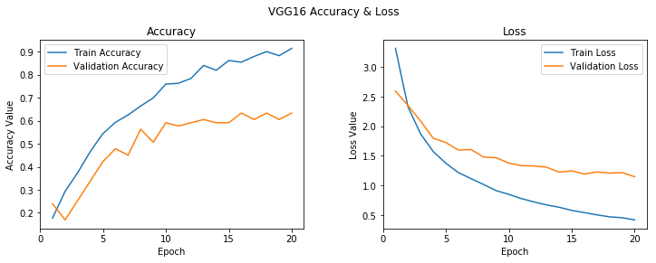


##### Predict the held-out test set


```python
VGG16_model.load_weights('saved_models/weights.best.VGG16.hdf5')
```


```python
VGG16_predictions = [np.argmax(VGG16_model.predict(np.expand_dims(feature, axis=0))) for feature in test_VGG16]

# report test accuracy
test_accuracy = 100*np.sum(np.array(VGG16_predictions)==np.argmax(y_test, axis=1))/len(VGG16_predictions)
print('Test accuracy: %.4f%%' % test_accuracy)
```

    Test accuracy: 56.4706%


```python
VGG16_test_score = VGG16_model.evaluate(test_VGG16,y_test)
print("Log loss of the VGG16 model is {0}".format(VGG16_test_score[0]))
```

    85/85 [==============================] - 0s 253us/step
    Log loss of the VGG16 model is 1.2718483896816477


Clearly, Our VGG16 Model seem to overfit the training set. Let us try out other models.


```python
plot_confusion_matrix(test_df.emotion, VGG16_predictions, classes=emotions, normalize=True,
                      title='Normalized VGG16 Confusion Matrix')

plt.show()

```

    Normalized confusion matrix


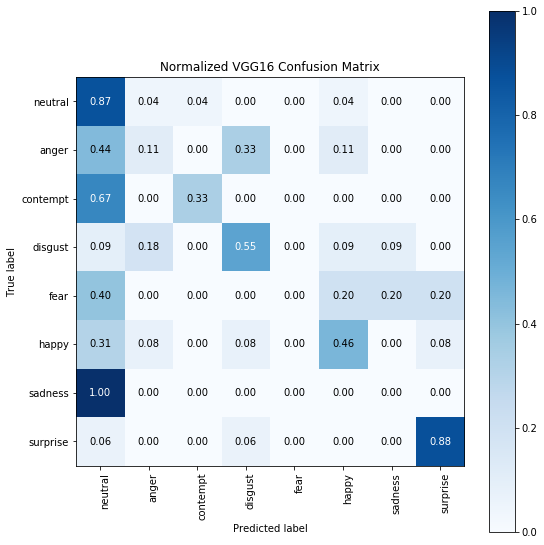


##### Build Transfer learned Xception


```python
from keras.applications.xception import Xception
from keras.applications.xception import preprocess_input as xception_preprocess
model_Xception = Xception(weights='imagenet', include_top=False)
```


```python
train_tensors_X_bottleneck = paths_to_tensor(train_files, model_Xception, xception_preprocess)
valid_tensors_X_bottleneck = paths_to_tensor(valid_files, model_Xception, xception_preprocess)
test_tensors_X_bottleneck = paths_to_tensor(test_files, model_Xception, xception_preprocess)
```

    100%|██████████| 283/283 [04:38<00:00,  1.03s/it]
    100%|██████████| 71/71 [01:13<00:00,  1.02it/s]
    100%|██████████| 85/85 [01:25<00:00,  1.03s/it]


```python
np.savez("bottleneck_features_X.npz", train=train_tensors_X_bottleneck, valid=valid_tensors_X_bottleneck, test=test_tensors_X_bottleneck)
```


```python
npzfile_X = np.load("bottleneck_features_X.npz")
npzfile_X.files
```


    ['train', 'valid', 'test']


```python
print('Training: ',train_tensors_X_bottleneck.shape)
print('Validation: ',valid_tensors_X_bottleneck.shape)
print('Test: ',test_tensors_X_bottleneck.shape)
```

    Training:  (283, 11, 11, 2048)
    Validation:  (71, 11, 11, 2048)
    Test:  (85, 11, 11, 2048)


```python
train_Xception = npzfile_X["train"]
valid_Xception = npzfile_X["valid"]
test_Xception = npzfile_X["test"]
```


```python
Xception_model = Sequential()
Xception_model.add(GlobalAveragePooling2D(input_shape=train_Xception.shape[1:]))
Xception_model.add(Dense(8, activation='softmax'))
Xception_model.summary()
```

    _________________________________________________________________
    Layer (type)                 Output Shape              Param #   
    =================================================================
    global_average_pooling2d_2 ( (None, 2048)              0         
    _________________________________________________________________
    dense_2 (Dense)              (None, 8)                 16392     
    =================================================================
    Total params: 16,392
    Trainable params: 16,392
    Non-trainable params: 0
    _________________________________________________________________


##### Compile the Xception Model 


```python
Xception_model.compile(loss='categorical_crossentropy', optimizer='adam', metrics=['accuracy'])
```


```python
checkpointer = ModelCheckpoint(filepath='saved_models/weights.best.Xception.hdf5',
                               verbose=1, save_best_only=True)

Xception_history = Xception_model.fit(train_Xception, y_train,
          validation_data=(valid_Xception, y_valid),
          epochs=20, batch_size=20, callbacks=[checkpointer], verbose=1)
```

    Train on 283 samples, validate on 71 samples
    Epoch 1/20
    283/283 [==============================] - 2s 5ms/step - loss: 1.9487 - acc: 0.3286 - val_loss: 1.9018 - val_acc: 0.3803
    
    Epoch 00001: val_loss improved from inf to 1.90182, saving model to saved_models/weights.best.Xception.hdf5
    Epoch 2/20
    283/283 [==============================] - 0s 1ms/step - loss: 1.6586 - acc: 0.4134 - val_loss: 1.7335 - val_acc: 0.4789
    
    Epoch 00002: val_loss improved from 1.90182 to 1.73353, saving model to saved_models/weights.best.Xception.hdf5
    Epoch 3/20
    283/283 [==============================] - 0s 997us/step - loss: 1.5219 - acc: 0.4876 - val_loss: 1.6028 - val_acc: 0.4507
    
    Epoch 00003: val_loss improved from 1.73353 to 1.60277, saving model to saved_models/weights.best.Xception.hdf5
    Epoch 4/20
    283/283 [==============================] - 0s 1ms/step - loss: 1.4063 - acc: 0.5124 - val_loss: 1.5591 - val_acc: 0.5493
    
    Epoch 00004: val_loss improved from 1.60277 to 1.55914, saving model to saved_models/weights.best.Xception.hdf5
    Epoch 5/20
    283/283 [==============================] - 0s 1ms/step - loss: 1.3326 - acc: 0.5583 - val_loss: 1.5035 - val_acc: 0.5634
    
    Epoch 00005: val_loss improved from 1.55914 to 1.50350, saving model to saved_models/weights.best.Xception.hdf5
    Epoch 6/20
    283/283 [==============================] - 0s 1ms/step - loss: 1.2446 - acc: 0.6360 - val_loss: 1.4370 - val_acc: 0.6620
    
    Epoch 00006: val_loss improved from 1.50350 to 1.43697, saving model to saved_models/weights.best.Xception.hdf5
    Epoch 7/20
    283/283 [==============================] - 0s 1ms/step - loss: 1.1954 - acc: 0.6431 - val_loss: 1.3829 - val_acc: 0.6338
    
    Epoch 00007: val_loss improved from 1.43697 to 1.38294, saving model to saved_models/weights.best.Xception.hdf5
    Epoch 8/20
    283/283 [==============================] - 0s 2ms/step - loss: 1.1444 - acc: 0.6007 - val_loss: 1.3669 - val_acc: 0.6479
    
    Epoch 00008: val_loss improved from 1.38294 to 1.36687, saving model to saved_models/weights.best.Xception.hdf5
    Epoch 9/20
    283/283 [==============================] - 0s 1ms/step - loss: 1.1088 - acc: 0.6926 - val_loss: 1.3334 - val_acc: 0.6620
    
    Epoch 00009: val_loss improved from 1.36687 to 1.33341, saving model to saved_models/weights.best.Xception.hdf5
    Epoch 10/20
    283/283 [==============================] - 0s 943us/step - loss: 1.0468 - acc: 0.6325 - val_loss: 1.3278 - val_acc: 0.6197
    
    Epoch 00010: val_loss improved from 1.33341 to 1.32781, saving model to saved_models/weights.best.Xception.hdf5
    Epoch 11/20
    283/283 [==============================] - 0s 1ms/step - loss: 1.0040 - acc: 0.6996 - val_loss: 1.2841 - val_acc: 0.6761
    
    Epoch 00011: val_loss improved from 1.32781 to 1.28415, saving model to saved_models/weights.best.Xception.hdf5
    Epoch 12/20
    283/283 [==============================] - 0s 1ms/step - loss: 0.9631 - acc: 0.6996 - val_loss: 1.2735 - val_acc: 0.6479
    
    Epoch 00012: val_loss improved from 1.28415 to 1.27354, saving model to saved_models/weights.best.Xception.hdf5
    Epoch 13/20
    283/283 [==============================] - 0s 1ms/step - loss: 0.9291 - acc: 0.7244 - val_loss: 1.2336 - val_acc: 0.6761
    
    Epoch 00013: val_loss improved from 1.27354 to 1.23362, saving model to saved_models/weights.best.Xception.hdf5
    Epoch 14/20
    283/283 [==============================] - 0s 1ms/step - loss: 0.8923 - acc: 0.7456 - val_loss: 1.2336 - val_acc: 0.6620
    
    Epoch 00014: val_loss improved from 1.23362 to 1.23359, saving model to saved_models/weights.best.Xception.hdf5
    Epoch 15/20
    283/283 [==============================] - 0s 1ms/step - loss: 0.8693 - acc: 0.7668 - val_loss: 1.2372 - val_acc: 0.6761
    
    Epoch 00015: val_loss did not improve from 1.23359
    Epoch 16/20
    283/283 [==============================] - 0s 1ms/step - loss: 0.8392 - acc: 0.7739 - val_loss: 1.1909 - val_acc: 0.6761
    
    Epoch 00016: val_loss improved from 1.23359 to 1.19089, saving model to saved_models/weights.best.Xception.hdf5
    Epoch 17/20
    283/283 [==============================] - 0s 1ms/step - loss: 0.8102 - acc: 0.7456 - val_loss: 1.1798 - val_acc: 0.6761
    
    Epoch 00017: val_loss improved from 1.19089 to 1.17979, saving model to saved_models/weights.best.Xception.hdf5
    Epoch 18/20
    283/283 [==============================] - 0s 969us/step - loss: 0.7908 - acc: 0.7915 - val_loss: 1.1899 - val_acc: 0.6761
    
    Epoch 00018: val_loss did not improve from 1.17979
    Epoch 19/20
    283/283 [==============================] - 0s 1ms/step - loss: 0.7619 - acc: 0.7739 - val_loss: 1.1686 - val_acc: 0.6761
    
    Epoch 00019: val_loss improved from 1.17979 to 1.16855, saving model to saved_models/weights.best.Xception.hdf5
    Epoch 20/20
    283/283 [==============================] - 0s 1ms/step - loss: 0.7448 - acc: 0.7880 - val_loss: 1.1338 - val_acc: 0.6761
    
    Epoch 00020: val_loss improved from 1.16855 to 1.13381, saving model to saved_models/weights.best.Xception.hdf5


```python
plot_accuracy_loss_for_train_valid(Xception_history, "Xception Accuracy & Loss")
```


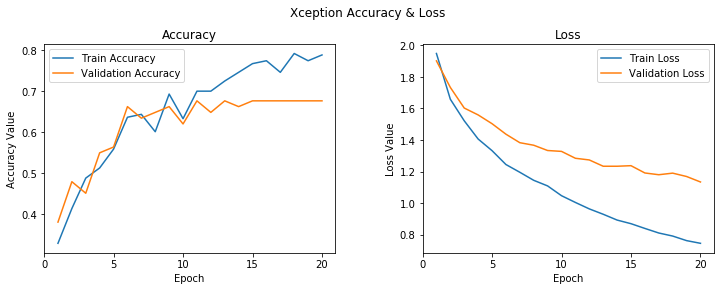


This time even the validation accuracy was not great.

##### Load the Best Xception weights from training


```python
Xception_model.load_weights('saved_models/weights.best.Xception.hdf5')
```

##### Get the accuracy for the model


```python
Xception_predictions = [np.argmax(Xception_model.predict(np.expand_dims(feature, axis=0))) for feature in test_Xception]

# report test accuracy
test_accuracy = 100*np.sum(np.array(Xception_predictions)==np.argmax(y_test, axis=1))/len(Xception_predictions)
print('Test accuracy: %.4f%%' % test_accuracy)
```

    Test accuracy: 61.1765%


```python
Xception_test_score = Xception_model.evaluate(test_Xception,y_test)
print("Log loss of the Xception model is {0}".format(Xception_test_score[0]))
```

    85/85 [==============================] - 0s 787us/step
    Log loss of the Xception model is 1.1427874403841356


```python
plot_confusion_matrix(test_df.emotion, Xception_predictions, classes=emotions, normalize=True,
                      title='Normalized Xception Confusion Matrix')

plt.show()
```

    Normalized confusion matrix


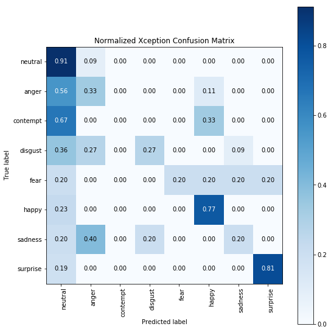


##### Observations from our previous implementations of Transfer Learning

1. In both VGG16 and Xception Transfer learning experiments we saw that the Training Accuracy and Training loss imporves drastically. But the Validation accuracy and losses suffer reaching a plateau in a few iterations.

2. The deep models has not got enough data to express the right emotions. We can see that in the confusion matrix. We see a lot of false positives.

The Hyper parameters in our model are:
1. no of epochs
2. Batch size
3. Learning rate ( we have used the default learning rate)
4. Gradient optimization algorithm ( We have used Adam)

But before we tune any of this, I want to provide augumented images to the model and see its performance.

##### Load the input for Augumented VGG16 model


```python
def get_aug_input_features(img_paths):
    list_of_tensors = [path_to_tensor(img_path, None, None, transfer_learn=False) for img_path in tqdm(img_paths)]
    return np.vstack(list_of_tensors)
```


```python
train_aug_tensors_VGG = get_aug_input_features(train_files)
valid_aug_tensors_VGG = get_aug_input_features(valid_files)
test_aug_tensors_VGG = get_aug_input_features(test_files)
```

    100%|██████████| 283/283 [00:00<00:00, 412.78it/s]
    100%|██████████| 71/71 [00:00<00:00, 462.75it/s]
    100%|██████████| 85/85 [00:00<00:00, 456.30it/s]


**Image Augumentation**

  The Neural network agents that learn the emotions behind scenes only learn the pixel. These pixels are basically RGB inputs.Our underlying problem of less data to learn can be solved by introducing different versions of the same images transforming their scale, position and rotations of the image.This gives more concrete representations among each emotion and might increase the accuracy of the transfer learned network. Our goal is to see if this avoid overfitting. 


If seen above we have non-uniform data for different emotion classes and it is limited. To take care of this problem, we do data augmentation by rotating, shifting and flipping and more such combinations to get more data with the already existing one. Majorly rotation, width and height shift, and horizontal flip will be required. This cannot solve the problem of non-uniformity completely as the data difference is large in this case.

I have employed the following transformations:

1. featurewise_center = `False`- Do not set input mean to 0 over the dataset
2. samplewise_center = `False` - Do not set each sample mean to 0
3. featurewise_std_normalization = `False` - Do not divide inputs by std of the dataset, feature-wise.
4. samplewise_std_normalization = `False` - Do not divide each input by its std.
5. zca_whitening = `False` - Do not do ZCA whitening. Learn more about whitening transformations [here](https://en.wikipedia.org/wiki/Whitening_transformation).
6. rotation_range =`50` - Rotate images upto 50 degrees
7. width_shift_range = `0.2` - Shift width by 20 %
8. height_shift_range = `0.2` - Shift height by 20 %
9. horizontal_flip = `True` - Flip the image horizontally randomly
10. vertical_flip = `False` - Do not Flip the images vertically
11. fill_mode = `nearest` - fill in new pixels for images after we apply any of the preceding operations (especially rotation or translation). In this case, we just fill in the new pixels with their nearest surrounding pixel values.

I will create two `datagen.flow` objects. One for train and one for validation. The train flow will have a batch of 32 inputs trained and learned using backpropagation. The valid set is used to get validation loss and accuracy after training the model from each batch.


```python
from keras.preprocessing.image import ImageDataGenerator

train_datagen = ImageDataGenerator(
    featurewise_center=False,
    samplewise_center=False,
    featurewise_std_normalization=False,
    samplewise_std_normalization=False,
    zca_whitening=False,
    rotation_range=50,
    width_shift_range=0.2,
    height_shift_range=0.2,
    horizontal_flip=True,
    vertical_flip=False,
    fill_mode='nearest'
    )

val_datagen = ImageDataGenerator()

train_generator = train_datagen.flow(train_aug_tensors_VGG, y_train, batch_size=32)
val_generator = val_datagen.flow(valid_aug_tensors_VGG, y_valid, batch_size=71)
```

##### Image augumented VGG16 model components
There are total of 6 components to our image augumented VGG16 model.

1. VGG16 model itself. Our Input to the VGG16 model will be a image of (resized length, resized width, # of channels). We will not take the last layer of the VGG16 model. We will make sure none of the layers of our VGG16 model is trained. We will also make sure that we pass down the output of the VGG16 model as input to the lower layers of our image augumented custom VGG16 model.

2. Global Average Pooling layer 2D which will take the 512 max values from the output of the VGG16 model.
3. A dense layer which will result 8 different class output.
4. Compile the model with loss function `categorical_crossentrophy` and gradient optimizer as adam.Also we are interested in Accuracy metric.
5. We will develop 3 callback functions. `ModelCheckpoint` will save only the model with best validation loss. `ReduceLROnPlateau` will automatically reduce the learning rate of the gradient optimization function by a percentage if it sees a plateau like validation loss for last 5 epochs. `EarlyStopping` will stop the training if it sees no imporvement in validation loss for the last 3 continuous epochs. Which infact makes `ReduceLROnPlateau` dummy though. 
6. Steps per epoch and validation steps detemine how many batches in a epoch needs to be trained and validated respectively. Its generally a proportion of the total # of samples / batch size 


```python
# https://towardsdatascience.com/a-comprehensive-hands-on-guide-to-transfer-learning-with-real-world-applications-in-deep-learning-212bf3b2f27a
vgg_aug = VGG16(include_top=False, weights='imagenet', 
                                     input_shape=(350,350,3))

vgg_aug_output = vgg_aug.layers[-1].output
#vgg_aug_output = keras.layers.Flatten()(vgg_aug_output)
vgg_aug_model = Model(vgg_aug.input, vgg_aug_output)

vgg_aug_model.trainable = False
for layer in vgg_aug_model.layers:
    layer.trainable = False

pd.set_option('max_colwidth', -1)
layers = [(layer, layer.name, layer.trainable) for layer in vgg_aug_model.layers]
pd.DataFrame(layers, columns=['Layer Type', 'Layer Name', 'Layer Trainable'])
```


<div>
<style scoped>
    .dataframe tbody tr th:only-of-type {
        vertical-align: middle;
    }

    .dataframe tbody tr th {
        vertical-align: top;
    }

    .dataframe thead th {
        text-align: right;
    }
</style>
<table border="1" class="dataframe">
  <thead>
    <tr style="text-align: right;">
      <th></th>
      <th>Layer Type</th>
      <th>Layer Name</th>
      <th>Layer Trainable</th>
    </tr>
  </thead>
  <tbody>
    <tr>
      <th>0</th>
      <td>&lt;keras.engine.input_layer.InputLayer object at 0x7f981c351898&gt;</td>
      <td>input_3</td>
      <td>False</td>
    </tr>
    <tr>
      <th>1</th>
      <td>&lt;keras.layers.convolutional.Conv2D object at 0x7f981c3519e8&gt;</td>
      <td>block1_conv1</td>
      <td>False</td>
    </tr>
    <tr>
      <th>2</th>
      <td>&lt;keras.layers.convolutional.Conv2D object at 0x7f981c351dd8&gt;</td>
      <td>block1_conv2</td>
      <td>False</td>
    </tr>
    <tr>
      <th>3</th>
      <td>&lt;keras.layers.pooling.MaxPooling2D object at 0x7f981c269630&gt;</td>
      <td>block1_pool</td>
      <td>False</td>
    </tr>
    <tr>
      <th>4</th>
      <td>&lt;keras.layers.convolutional.Conv2D object at 0x7f981c269518&gt;</td>
      <td>block2_conv1</td>
      <td>False</td>
    </tr>
    <tr>
      <th>5</th>
      <td>&lt;keras.layers.convolutional.Conv2D object at 0x7f981c2202e8&gt;</td>
      <td>block2_conv2</td>
      <td>False</td>
    </tr>
    <tr>
      <th>6</th>
      <td>&lt;keras.layers.pooling.MaxPooling2D object at 0x7f981c1b9908&gt;</td>
      <td>block2_pool</td>
      <td>False</td>
    </tr>
    <tr>
      <th>7</th>
      <td>&lt;keras.layers.convolutional.Conv2D object at 0x7f981c1b9470&gt;</td>
      <td>block3_conv1</td>
      <td>False</td>
    </tr>
    <tr>
      <th>8</th>
      <td>&lt;keras.layers.convolutional.Conv2D object at 0x7f981c1f05c0&gt;</td>
      <td>block3_conv2</td>
      <td>False</td>
    </tr>
    <tr>
      <th>9</th>
      <td>&lt;keras.layers.convolutional.Conv2D object at 0x7f981c188ba8&gt;</td>
      <td>block3_conv3</td>
      <td>False</td>
    </tr>
    <tr>
      <th>10</th>
      <td>&lt;keras.layers.pooling.MaxPooling2D object at 0x7f981c13a320&gt;</td>
      <td>block3_pool</td>
      <td>False</td>
    </tr>
    <tr>
      <th>11</th>
      <td>&lt;keras.layers.convolutional.Conv2D object at 0x7f981c1a3f28&gt;</td>
      <td>block4_conv1</td>
      <td>False</td>
    </tr>
    <tr>
      <th>12</th>
      <td>&lt;keras.layers.convolutional.Conv2D object at 0x7f981c157f28&gt;</td>
      <td>block4_conv2</td>
      <td>False</td>
    </tr>
    <tr>
      <th>13</th>
      <td>&lt;keras.layers.convolutional.Conv2D object at 0x7f981c1096a0&gt;</td>
      <td>block4_conv3</td>
      <td>False</td>
    </tr>
    <tr>
      <th>14</th>
      <td>&lt;keras.layers.pooling.MaxPooling2D object at 0x7f981c125e10&gt;</td>
      <td>block4_pool</td>
      <td>False</td>
    </tr>
    <tr>
      <th>15</th>
      <td>&lt;keras.layers.convolutional.Conv2D object at 0x7f981c1256d8&gt;</td>
      <td>block5_conv1</td>
      <td>False</td>
    </tr>
    <tr>
      <th>16</th>
      <td>&lt;keras.layers.convolutional.Conv2D object at 0x7f981c0d7978&gt;</td>
      <td>block5_conv2</td>
      <td>False</td>
    </tr>
    <tr>
      <th>17</th>
      <td>&lt;keras.layers.convolutional.Conv2D object at 0x7f981c0f2f98&gt;</td>
      <td>block5_conv3</td>
      <td>False</td>
    </tr>
    <tr>
      <th>18</th>
      <td>&lt;keras.layers.pooling.MaxPooling2D object at 0x7f981c0aa978&gt;</td>
      <td>block5_pool</td>
      <td>False</td>
    </tr>
  </tbody>
</table>
</div>


```python
input_shape = vgg_aug_model.output_shape[1:]

model_vgg_aug = Sequential()
model_vgg_aug.add(vgg_aug_model)
model_vgg_aug.add(GlobalAveragePooling2D(input_shape=input_shape))
model_vgg_aug.add(Dense(8, activation='sigmoid'))

model_vgg_aug.summary()
```

    _________________________________________________________________
    Layer (type)                 Output Shape              Param #   
    =================================================================
    model_1 (Model)              (None, 10, 10, 512)       14714688  
    _________________________________________________________________
    global_average_pooling2d_3 ( (None, 512)               0         
    _________________________________________________________________
    dense_3 (Dense)              (None, 8)                 4104      
    =================================================================
    Total params: 14,718,792
    Trainable params: 4,104
    Non-trainable params: 14,714,688
    _________________________________________________________________


```python
model_vgg_aug.compile(loss='categorical_crossentropy',
             optimizer='adam',
             metrics=['accuracy'])
```


```python
train_steps_per_epoch_vgg = train_aug_tensors_VGG.shape[0]//32
val_steps_per_epoch_vgg = valid_aug_tensors_VGG.shape[0]//71
print(train_steps_per_epoch_vgg, val_steps_per_epoch_vgg)
```

    8 1


```python
from keras.callbacks import EarlyStopping, ReduceLROnPlateau
model_vgg_aug_checkpointer = ModelCheckpoint(filepath='saved_models/weights.best.vgg_aug.hdf5',
                               verbose=1, save_best_only=True)
reduce_lr = ReduceLROnPlateau(monitor='val_loss', factor=0.1, patience=5, verbose=0, mode='auto', min_delta=0.0001, cooldown=0, min_lr=0)
early_stop = EarlyStopping(monitor='val_loss', min_delta=0, patience=3, verbose=0, mode='auto')

model_vgg_aug_history = model_vgg_aug.fit_generator(train_generator, steps_per_epoch=train_steps_per_epoch_vgg, epochs=10,
                              validation_data=val_generator, validation_steps=val_steps_per_epoch_vgg, callbacks=[model_vgg_aug_checkpointer, early_stop, reduce_lr],
                              verbose=1)
```

    Epoch 1/10
    8/8 [==============================] - 185s 23s/step - loss: 2.1124 - acc: 0.1484 - val_loss: 1.9981 - val_acc: 0.2254
    
    Epoch 00001: val_loss improved from inf to 1.99813, saving model to saved_models/weights.best.vgg_aug.hdf5
    Epoch 2/10
    8/8 [==============================] - 181s 23s/step - loss: 1.9583 - acc: 0.2407 - val_loss: 1.9860 - val_acc: 0.2113
    
    Epoch 00002: val_loss improved from 1.99813 to 1.98597, saving model to saved_models/weights.best.vgg_aug.hdf5
    Epoch 3/10
    8/8 [==============================] - 177s 22s/step - loss: 1.9275 - acc: 0.2368 - val_loss: 1.9617 - val_acc: 0.2113
    
    Epoch 00003: val_loss improved from 1.98597 to 1.96172, saving model to saved_models/weights.best.vgg_aug.hdf5
    Epoch 4/10
    8/8 [==============================] - 178s 22s/step - loss: 1.8674 - acc: 0.2381 - val_loss: 1.9262 - val_acc: 0.2113
    
    Epoch 00004: val_loss improved from 1.96172 to 1.92620, saving model to saved_models/weights.best.vgg_aug.hdf5
    Epoch 5/10
    8/8 [==============================] - 177s 22s/step - loss: 1.8454 - acc: 0.2251 - val_loss: 1.9390 - val_acc: 0.2113
    
    Epoch 00005: val_loss did not improve from 1.92620
    Epoch 6/10
    8/8 [==============================] - 177s 22s/step - loss: 1.8225 - acc: 0.2264 - val_loss: 1.8938 - val_acc: 0.2113
    
    Epoch 00006: val_loss improved from 1.92620 to 1.89385, saving model to saved_models/weights.best.vgg_aug.hdf5
    Epoch 7/10
    8/8 [==============================] - 186s 23s/step - loss: 1.7521 - acc: 0.2022 - val_loss: 1.8705 - val_acc: 0.2113
    
    Epoch 00007: val_loss improved from 1.89385 to 1.87052, saving model to saved_models/weights.best.vgg_aug.hdf5
    Epoch 8/10
    8/8 [==============================] - 180s 23s/step - loss: 1.7469 - acc: 0.2635 - val_loss: 1.8485 - val_acc: 0.1831
    
    Epoch 00008: val_loss improved from 1.87052 to 1.84853, saving model to saved_models/weights.best.vgg_aug.hdf5
    Epoch 9/10
    8/8 [==============================] - 187s 23s/step - loss: 1.7209 - acc: 0.2447 - val_loss: 1.8346 - val_acc: 0.2113
    
    Epoch 00009: val_loss improved from 1.84853 to 1.83460, saving model to saved_models/weights.best.vgg_aug.hdf5
    Epoch 10/10
    8/8 [==============================] - 199s 25s/step - loss: 1.7080 - acc: 0.2461 - val_loss: 1.8287 - val_acc: 0.2394
    
    Epoch 00010: val_loss improved from 1.83460 to 1.82870, saving model to saved_models/weights.best.vgg_aug.hdf5


```python
# epoch len depends on # of epochs that got trained. Print and see model_vgg_aug_history.history
plot_accuracy_loss_for_train_valid(model_vgg_aug_history, "Augumented VGG  Accuracy & Loss", epoch_len=11, epoch_window=2)
```


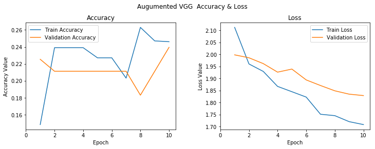


A very sad graph where we see no learning. Lets see the confusion matrix.

##### Load the Best Augumented VGG16 weights from training


```python
model_vgg_aug.load_weights('saved_models/weights.best.vgg_aug.hdf5')
```

##### Get the accuracy for the model


```python
model_vgg_aug_predictions = [np.argmax(model_vgg_aug.predict(np.expand_dims(feature, axis=0))) for feature in test_aug_tensors_VGG]

# report test accuracy
test_accuracy = 100*np.sum(np.array(model_vgg_aug_predictions)==np.argmax(y_test, axis=1))/len(model_vgg_aug_predictions)
print('Test accuracy: %.4f%%' % test_accuracy)
```

    Test accuracy: 21.1765%


```python
vgg_aug_test_score = model_vgg_aug.evaluate(test_aug_tensors_VGG,y_test)
print("Log loss of the Xception model is {0}".format(vgg_aug_test_score[0]))
```

    85/85 [==============================] - 50s 584ms/step
    Log loss of the Xception model is 1.7826211228090174


```python
plot_confusion_matrix(test_df.emotion, model_vgg_aug_predictions, classes=emotions, normalize=True,
                      title='Normalized Augumented VGG Confusion Matrix')

plt.show()
```

    Normalized confusion matrix


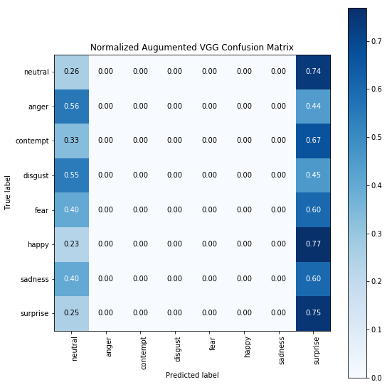


Clearly the model has not learned anything. Also I realized what a mess it would be if we believe only on accuracy as a metric. I read the [Accuracy Paradox](https://towardsdatascience.com/accuracy-paradox-897a69e2dd9b). But I am not going to implement other scoring metrics like f2beta score. I feel that the neural networks cannot do anymore of learning for this carefully curated and constrained dataset.

### Lessons Learned

1. Having accuracy as a metric for a non uniformly distributed multiclass classification problem would lead us to the Accuracy paradox. 
2. Neural networks are not really a viable solution for a carefully curated dataset.
3. Doing data augumentation on a curated dataset will not impact the learning positively.
4. Less data is same as no data.


### References

https://github.com/mayurmadnani/fer   
https://towardsdatascience.com/a-comprehensive-hands-on-guide-to-transfer-learning-with-real-world-applications-in-deep-learning-212bf3b2f27a
